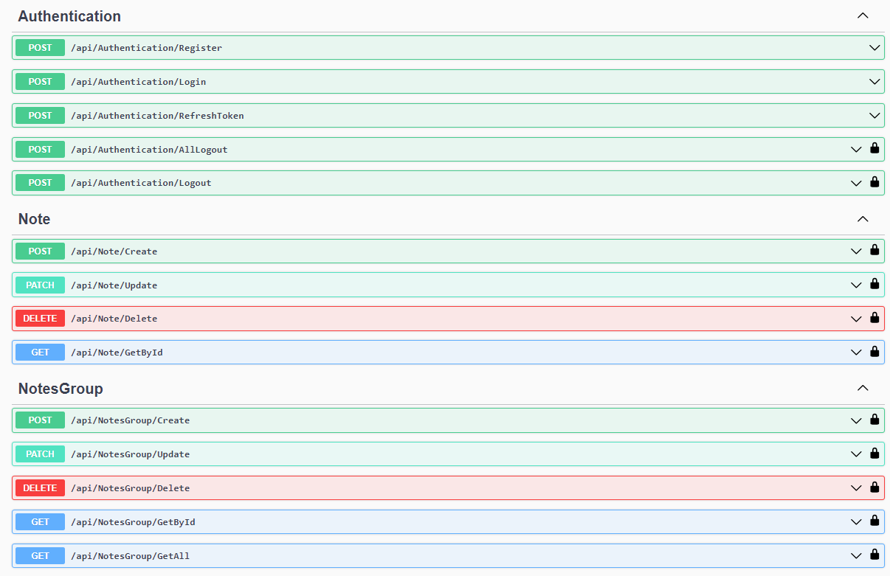
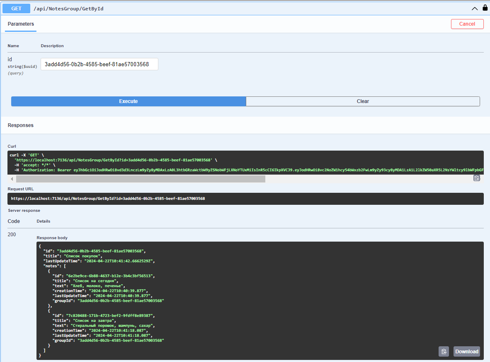

# NotesWebApi
WebApi для хранения заметок с авторизацией на jwt-токенах. 

## Что используется
1. Asp.net
2. Entity Framework
3. MS SQL Server

## Как применить миграции
1. Открыть консоль менеджера пакетов nuget
2. Прописать: update-database

## Сущности
1. Группа заметок
2. Заметка
3. Пользователь
4. RefreshToken пользователя

## Конечные точки

## Пример
